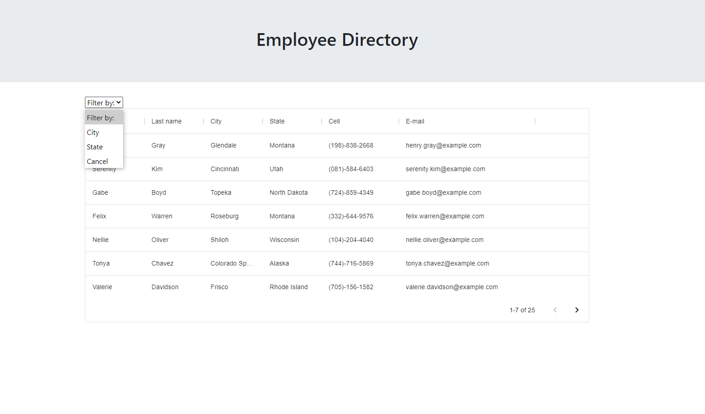

# Employee Directory

## Overview

An employee directory with React. Here we break the application's UI into components, manage component state, and respond to user events.

## User Story

* An user, Wants to be able to view his entire employee directory at once so that He can have quick access to their information.

## Business Context

An employee or manager would benefit greatly from being able to view non-sensitive data about other employees. It would be particularly helpful to be able to filter employees by name and filter them by an specific State or City. 

- - -

### __This is a link to a deployed application:__

_[Click Here for the Heroku’s Deployed Application](https:yyyy/)_

- - -
### **This is a preview of the app**

